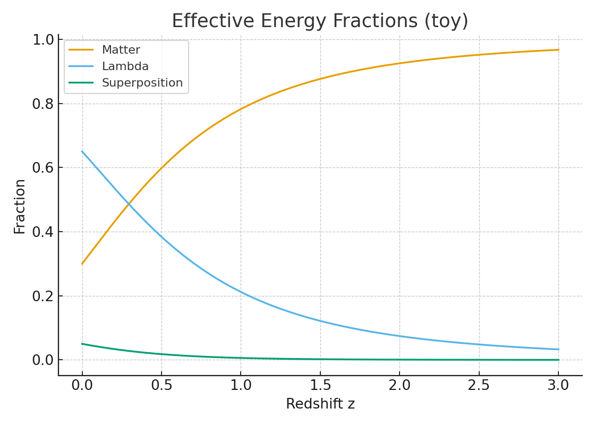
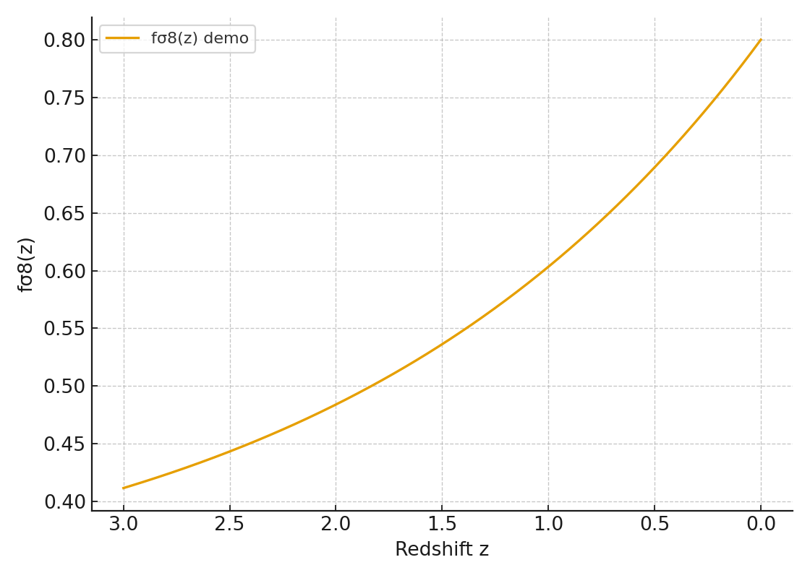
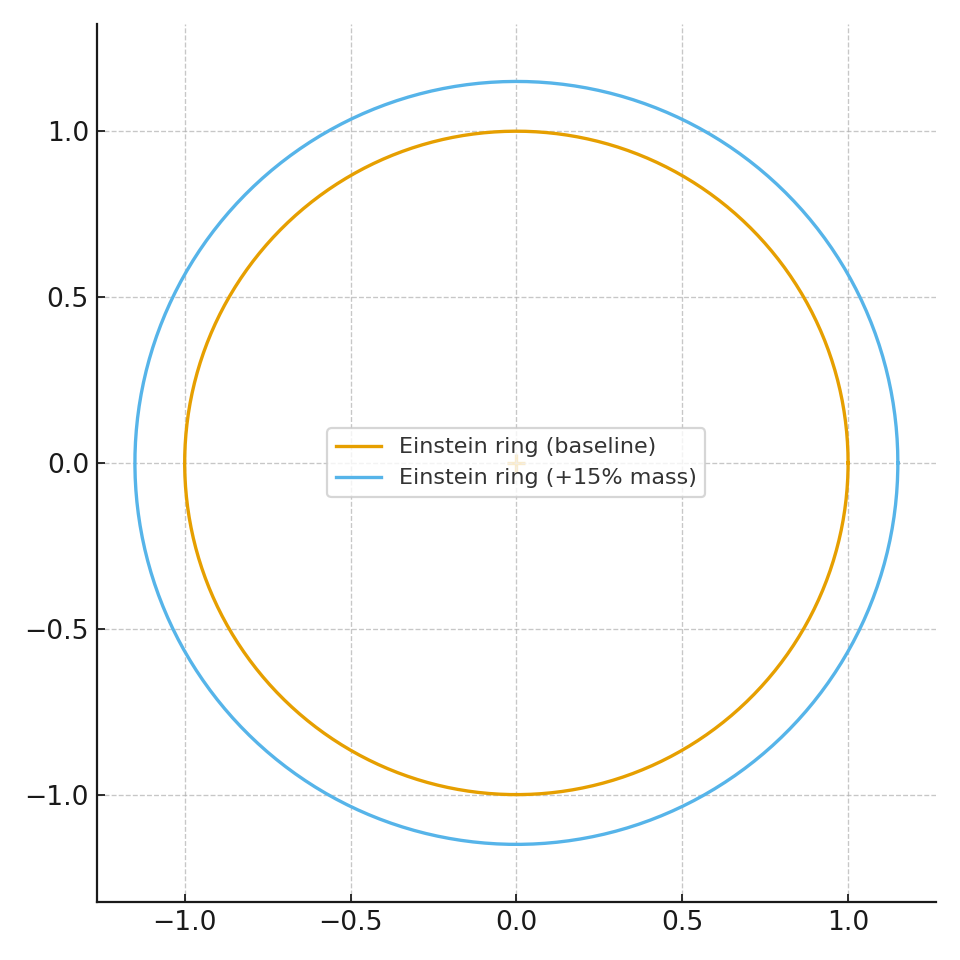

# Relativity Living Light

**Norma canônica de convenções globais:** [docs/canonicos/CONVENCOES_GLOBAIS_RLL.md](docs/canonicos/CONVENCOES_GLOBAIS_RLL.md)


**📘 Trilha principal oficial do livro:** [book/README.md](book/README.md)

**Resumo de validação observacional:** validação ainda em estágio **Sintético**, com integração **Parcial real** em preparação e sem etapa **Real validado** concluída.

[](https://doi.org/10.5281/zenodo.17188137)

Repositório principal do modelo **Relativity Living Light (RLL)**, com foco em cosmologia de superposição dinâmica, documentação técnico-científica, trilhas de validação observacional e acervo autoral RAFAELIA (∆RafaelVerboΩ).

---


## Status dos Dados

- **Sintético:** simulações internas, mocks e diagnósticos computacionais sem inferência observacional final.
- **Parcial real:** uso de dados observacionais reais em parte do pipeline, ainda sem validação cruzada completa.
- **Real validado:** resultados reproduzíveis com dados reais, checagens estatísticas e documentação de validação concluídas.

**Nível atual deste README:** `Sintético` (com trilha `Parcial real` em andamento).

---

## 0) Preservação integral de conteúdo (sem perda)

Para eliminar risco de perda textual, o conteúdo histórico completo do `README.md` anterior foi preservado em:

- [docs/README_ROOT_LEGACY_ARCHIVE.md](docs/README_ROOT_LEGACY_ARCHIVE.md)

Validação de integridade (histórico Git):

```bash
git show 64a12a3:README.md
```

Este `README.md` atual é uma camada de organização técnica; o acervo narrativo/autoral foi mantido e rastreável.

---

## 1) Visão geral técnica

O RLL propõe uma extensão efetiva da dinâmica cosmológica via componente de superposição fotônica com transição controlada por função logística, acoplada a termos magnéticos e plasmáticos:

```math
E^2(a)=\Omega_r a^{-4}+\Omega_m a^{-3}+\Omega_\Lambda
+\Omega_{s0}[f(a)+(1-f)a^{-3}]
+\Omega_{B0}a^{-4}+\Omega_{P0}a^{-4}
```

com:

```math
f(z)=\frac{1}{1+\exp((z-z_t)/w_t)}
```

### Convenção oficial de sinais e limites

Fonte canônica explícita: [`docs/canonicos/09_GLOSSARIO_COMPLETO.md`](docs/canonicos/09_GLOSSARIO_COMPLETO.md).

- **Fórmula oficial:** \(f(z)=1/[1+\exp((z-z_t)/w_t)]\).
- **Hipótese oficial de sinal/intervalo para \(w_t\):** adota-se \(w_t<0\), com \(|w_t|\in[0.1,1.0]\) (mesma escala canônica do glossário para largura de transição).
- **Exemplos numéricos (referência: \(z_t=1.0\), \(w_t=-0.3\)):**
  - \(z=0\): \(f(0)=1/[1+e^{(0-1)/(-0.3)}]\approx0.034\) (baixo).
  - \(z=z_t\): \(f(z_t)=0.5\) (ponto de transição).
  - \(z\gg z_t\) (ex.: \(z=5\)): \(f(5)=1/[1+e^{(5-1)/(-0.3)}]\approx0.999998\) (alto).
- **Interpretação física coerente:** nessa convenção, o setor de superposição fica **dominante em alto redshift** (\(f\to1\), comportamento tipo energia escura efetiva) e **subdominante em baixo redshift** (\(f\to0\), comportamento tipo matéria efetiva), com transição suave em torno de \(z_t\).

### Objetivo operacional

- comparar RLL vs ΛCDM em observáveis de expansão e crescimento;
- manter rastreabilidade de dados, figuras e versões documentais;
- separar trilha científica (core) da trilha conceitual/autoral.

---

## 2) Navegação principal (canônica)

### Núcleo científico

- [docs/Relativity_Living_Light.md](docs/Relativity_Living_Light.md)
- [docs/Results.md](docs/Results.md)
- [docs/BOOSTERS.md](docs/BOOSTERS.md)
- [docs/COMPARACAO_DESI_2025.md](docs/COMPARACAO_DESI_2025.md)
- [docs/ROADMAP_VALIDACAO.md](docs/ROADMAP_VALIDACAO.md)
- [docs/REFERENCES.md](docs/REFERENCES.md)
- [docs/PLANO_ABCD_JWST_AGN_SMBH.md](docs/PLANO_ABCD_JWST_AGN_SMBH.md)
- [docs/ARQUITETURA_DUAS_RADIACOES_IMPLEMENTACAO.md](docs/ARQUITETURA_DUAS_RADIACOES_IMPLEMENTACAO.md)

### Governança e organização documental

- [docs/INDICE_MESTRE.md](docs/INDICE_MESTRE.md)
- [docs/RELEASE_NOTES_HISTORY.md](docs/RELEASE_NOTES_HISTORY.md)
- [docs/DOCUMENTATION_ORGANIZATION_MASTER.md](docs/DOCUMENTATION_ORGANIZATION_MASTER.md)
- [docs/DOCUMENTATION_FULL_INVENTORY.md](docs/DOCUMENTATION_FULL_INVENTORY.md)
- [docs/POLITICA_REPOSITORIO_TEXTO_E_ARTEFATOS.md](docs/POLITICA_REPOSITORIO_TEXTO_E_ARTEFATOS.md) *(fonte oficial para formatos no core e artefatos externos)*
- [docs/ZIP_CONTENT_INDEX.md](docs/ZIP_CONTENT_INDEX.md) *(inventário histórico; não é recomendação de armazenamento no core)*
- [docs/PLANO_AD_AGN_JWST.md](docs/PLANO_AD_AGN_JWST.md)

### Trilha autoral e conceitual (integridade de selo)

- [docs/MANIFESTO.md](docs/MANIFESTO.md)
- [docs/MAPA_RAFAELIA_TOTAL.md](docs/MAPA_RAFAELIA_TOTAL.md)
- [docs/SUPREMO UNIFICADO.md](docs/SUPREMO UNIFICADO.md)
- [docs/numeros_rafaelianos/Readme.md](docs/numeros_rafaelianos/Readme.md)

### Documentação complementar — Trilha de análise PhD (`newadd/`)

- [Índice da análise PhD](newadd/00_INDICE_ANALISE_PHD.md)
- [RLL × DESI — Cross Analysis (PhD)](newadd/01_RLL_DESI_CrossAnalysis_PhD.md)
- [Formulações Latentes — RAFAELIA/RLL](newadd/02_Formulacoes_Latentes_RAFAELIA_RLL.md)
- [Descrição Acadêmica PhD Completa](newadd/03_Descricao_Academica_PhD_Completa.md)

**Ordem recomendada de leitura (trilha PhD):**
1. `newadd/00_INDICE_ANALISE_PHD.md`
2. `newadd/01_RLL_DESI_CrossAnalysis_PhD.md`
3. `newadd/02_Formulacoes_Latentes_RAFAELIA_RLL.md`
4. `newadd/03_Descricao_Academica_PhD_Completa.md`

**Relação com os domínios 01–07 (RAFAELIA):**
- **Domínio 01 (Mathematics):** base formal em equações e isomorfismos apresentada em `01_` e aprofundada em `02_`.
- **Domínio 02 (Physics):** núcleo cosmológico/fenomenológico tratado sobretudo em `01_` e `03_`.
- **Domínio 03 (Computation):** metodologia de validação e integração com dados em `01_` e `03_`.
- **Domínio 04 (Geometry):** estrutura geométrica/analítica de apoio nas formulações latentes de `02_`.
- **Domínio 05 (Statistics):** critérios de ajuste, inferência e métricas (χ²/AIC/BIC/Bayes) em `01_` e `03_`.
- **Domínio 06 (Ethics Systems):** critérios de consistência e governança metodológica, com ponte RAFAELIA↔RLL em `02_` e `03_`.
- **Domínio 07 (Synthesis):** síntese integradora do programa PhD consolidada no índice (`00_`) e na descrição completa (`03_`).

**Consistência de nomes (evitar duplicidade de entrada):**
- `newadd/00_INDICE_ANALISE_PHD.md` é o índice canônico da trilha PhD para navegação no README raiz.
- `newadd/00_INDEX.md` permanece como índice acadêmico geral do compêndio RAFAELIA (escopo amplo), sem substituir o índice PhD acima.
**Relação com os domínios 01–07 (arcabouço RAFAELIA em `newadd/00_INDEX.md`):**
- **[01] Matemática + [02] Física + [05] Estatística:** base quantitativa da análise em `01_RLL_DESI_CrossAnalysis_PhD.md`.
- **[01] Matemática + [02] Física + [04] Geometria + [05] Estatística + [07] Síntese:** formalizações e provas em `02_Formulacoes_Latentes_RAFAELIA_RLL.md`.
- **[01]–[07] (integração completa):** enquadramento acadêmico, metodologia e posicionamento em `03_Descricao_Academica_PhD_Completa.md`.

**Consistência de nomes (evitar duplicidade):** usar `newadd/00_INDICE_ANALISE_PHD.md` como entrada canônica da trilha PhD em PT-BR; manter `newadd/00_INDEX.md` como índice técnico complementar (escopo acadêmico em inglês), sem cadastrar ambos como "índice principal".

---

## 3) Gráficos, infográficos e imagens

### 3.1 Figura de referência solicitada (`híbrido`)


### 3.2 Painel de resultados principais

| Tema | Selo de origem | Figura |
|---|---|---|
| Expansão cósmica H(z) | `mock` |  |
| Distância de luminosidade (Δμ) | `mock` |  |
| Frações de energia | `mock` |  |
| Dinâmica f(z) e w_eff | `mock` |  |

### 3.3 Painel observacional complementar

| Tema | Selo de origem | Figura |
|---|---|---|
| Crescimento de estrutura fσ₈(z) | `híbrido` |  |
| Lente em aglomerados | `híbrido` |  |
| Curva de rotação (SPARC) | `híbrido` |  |
| Ajuste H mock | `mock` |  |

---

## 4) Dados e reprodutibilidade

### Dados centrais

- `data/posterior_unified_synth.csv`
- `data/relativity_living_light_models.csv`
- `data/unified_entropy_margin_10_12.csv`
- `data/real/Hz_data_real.csv`
- `data/real/BAO_data_real.csv`

### Resultados e validação real

- `results/RLL_chi2_results.csv`
- `docs/rll_validation_real.py`
- `figs/paper/RLL_validacao_real.png`

### Notebooks

- `data/Hz_superposicao.ipynb`
- `data/density_decomp.ipynb`
- `data/rotation_model.ipynb`

### Bundles compactados

- `data/RelativityLivingLight_v4_bundle.zip`
- `data/relativity_bundle_results.zip`
- `docs/rll_revisado_v2.zip`

Política oficial de armazenamento/publicação: [docs/POLITICA_REPOSITORIO_TEXTO_E_ARTEFATOS.md](docs/POLITICA_REPOSITORIO_TEXTO_E_ARTEFATOS.md).

Inventário histórico interno dos bundles (legado): [docs/ZIP_CONTENT_INDEX.md](docs/ZIP_CONTENT_INDEX.md) *(não é recomendação de armazenamento no core)*.

---


## Fluxo canônico único (entrada → dados de entrada → saída)

- **Entrada (documentação e critérios):** `docs/`
  - referência central: `docs/DOCUMENTATION_ORGANIZATION_MASTER.md`
  - módulos migrados do Structure D: `docs/modules/structure_d_equations.md` e `docs/modules/structure_d_agn_feedback_bridge.md`
- **Dados de entrada e execução:** `data/`
  - pipeline modular: `data/pipelines/structure_d/`
  - inputs de exemplo: `data/inputs/structure_d/README.md`
- **Saída científica:** `results/`
  - outputs do fluxo Structure D: `results/structure_d/`

`to_Add/` permanece apenas como histórico de ingestão (sem papel operacional).

## CLI e empacotamento Python

O repositório agora pode ser instalado como pacote Python com entrada de comando `rll`.

### Instalação

```bash
pip install -e .
```

### Uso rápido

```bash
rll run --data synthetic --model rll
rll run --data real --model rll
rll run --data real --model rll --with-bayes --with-covariance
```

### Mapeamento de fluxos atuais

- `rll run --data synthetic ...` → `data/pipelines/structure_d/run_all.py`
- `rll run --data real ...` → `docs/rll_validation_real.py`
- `rll run --data real --with-bayes --with-covariance ...` → `docs/panteon_likelihood.py`

## 5) Bibliografia expandida (seleção essencial)

> Referência bibliográfica completa e ampliada: [docs/REFERENCES.md](docs/REFERENCES.md)

### Cosmologia observacional e modelo padrão

1. Planck Collaboration (2018), *Planck 2018 results. VI. Cosmological parameters*.  
   DOI: <https://doi.org/10.1051/0004-6361/201833910>
2. Riess et al. (1998), *Observational Evidence from Supernovae for an Accelerating Universe*.  
   DOI: <https://doi.org/10.1086/300499>
3. Perlmutter et al. (1999), *Measurements of Ω and Λ from 42 High-Redshift Supernovae*.  
   DOI: <https://doi.org/10.1086/307221>
4. Alam et al. (2017), *The clustering of galaxies in SDSS-III BOSS*.  
   DOI: <https://doi.org/10.1093/mnras/stx721>

### Crescimento, estrutura e tensões cosmológicas

5. DES Collaboration (2022), *Dark Energy Survey Year 3 Results*.  
   DOI: <https://doi.org/10.1103/PhysRevD.105.023520>
6. Euclid Collaboration (programa científico e forecasts).  
   URL: <https://www.euclid-ec.org/science/>
7. DESI Collaboration (BAO / growth program).  
   URL: <https://www.desi.lbl.gov/>

### Não-localidade fotônica e conexão conceitual

8. Nature Communications (2025), artigo relacionado à não-localidade fotônica e espaços paralelos.  
   DOI/ID: `s41467-025-63981-3`
9. Base analítica no repositório:
   - [docs/NATURE_ARTICLE_ANALYSIS.md](docs/NATURE_ARTICLE_ANALYSIS.md)
   - [docs/ARTICLE_ANALYSIS_SUMMARY.md](docs/ARTICLE_ANALYSIS_SUMMARY.md)
   - [docs/ANALISE_ARTIGO_NATURE_PT.md](docs/ANALISE_ARTIGO_NATURE_PT.md)

### Formalismo e extensão do modelo RLL

10. [docs/LAGRANGIANO_EFT.md](docs/LAGRANGIANO_EFT.md)
11. [docs/PERTURBACOES_CRESCIMENTO.md](docs/PERTURBACOES_CRESCIMENTO.md)
12. [docs/ESTABILIDADE_GHOST_CHECK.md](docs/ESTABILIDADE_GHOST_CHECK.md)
13. [docs/VELOCIDADE_SOM.md](docs/VELOCIDADE_SOM.md)
14. [docs/COMPARACAO_DESI_2025.md](docs/COMPARACAO_DESI_2025.md)

---

## 6) Como usar este repositório (fluxo curto)

1. Ler [docs/INDICE_MESTRE.md](docs/INDICE_MESTRE.md)
2. Validar resultados em [docs/Results.md](docs/Results.md)
3. Checar formulação em [docs/BOOSTERS.md](docs/BOOSTERS.md)
4. Verificar releases em [docs/RELEASE_NOTES_HISTORY.md](docs/RELEASE_NOTES_HISTORY.md)
5. Auditar inventário em [docs/DOCUMENTATION_FULL_INVENTORY.md](docs/DOCUMENTATION_FULL_INVENTORY.md)

---

## 7) Licença, autoria e integridade

- Licença: [LICENSE.md](LICENSE.md)
- Governança: [docs/ADMIN.md](docs/ADMIN.md)
- Autoria original: ∆RafaelVerboΩ
- Princípio de integridade textual RAFAELIA: preservar literais simbólicos (⊕ ⊗ ∮ ∫ √ π φ Δ Ω Σ ψ χ ρ ∧) e trilhas canônicas.

---

## 8) Nota de organização documental

Este `README.md` passa a atuar como **entrada principal organizada** do repositório. Conteúdo narrativo/autoral expandido permanece nos documentos dedicados da trilha conceitual para evitar mistura de escopos em leitura técnica.


`news/` foi consolidado: os arquivos canônicos foram integrados aos diretórios `data/real/`, `docs/`, `figs/paper/` e `results/`, mantendo histórico em `news/archive_legacy/`.
