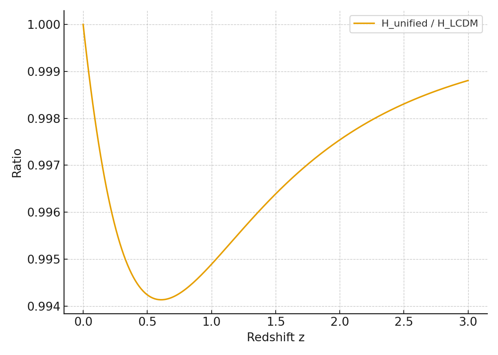
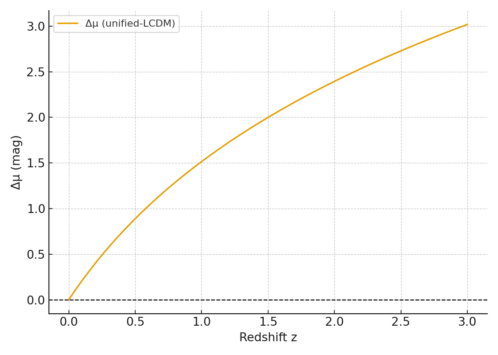
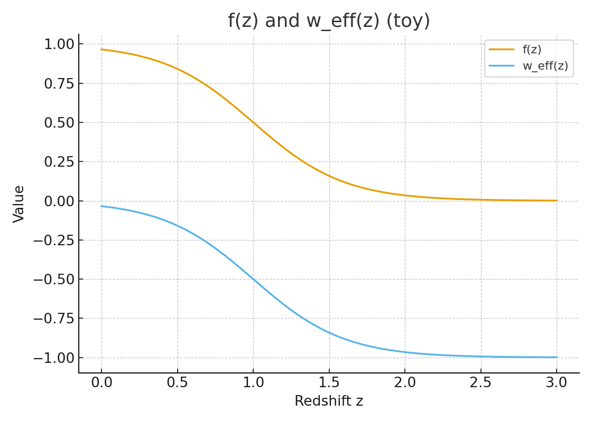
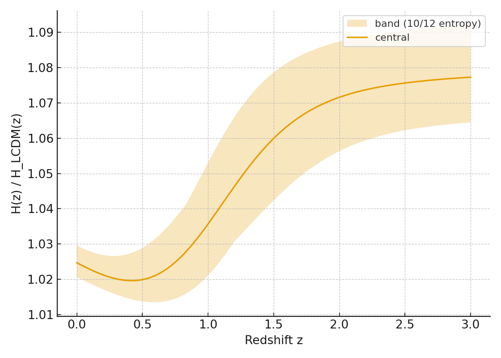
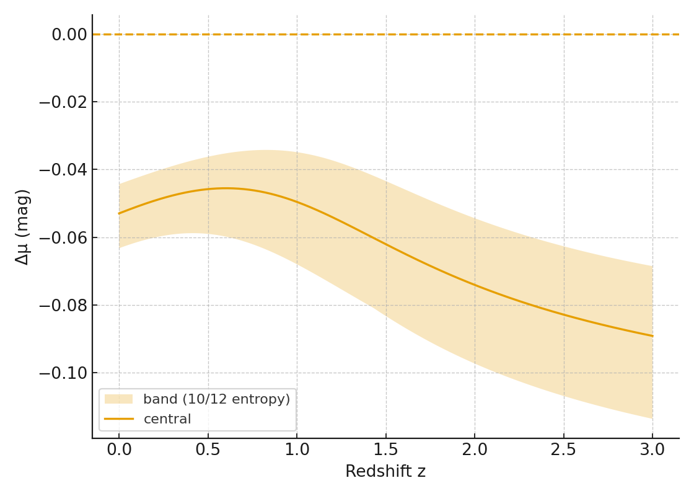
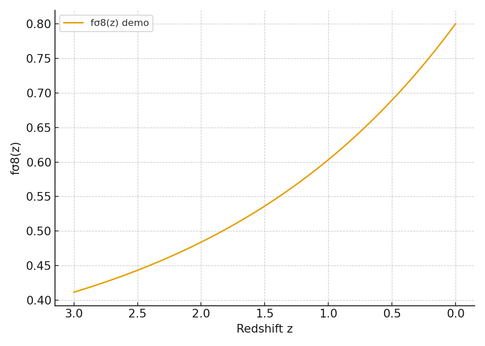
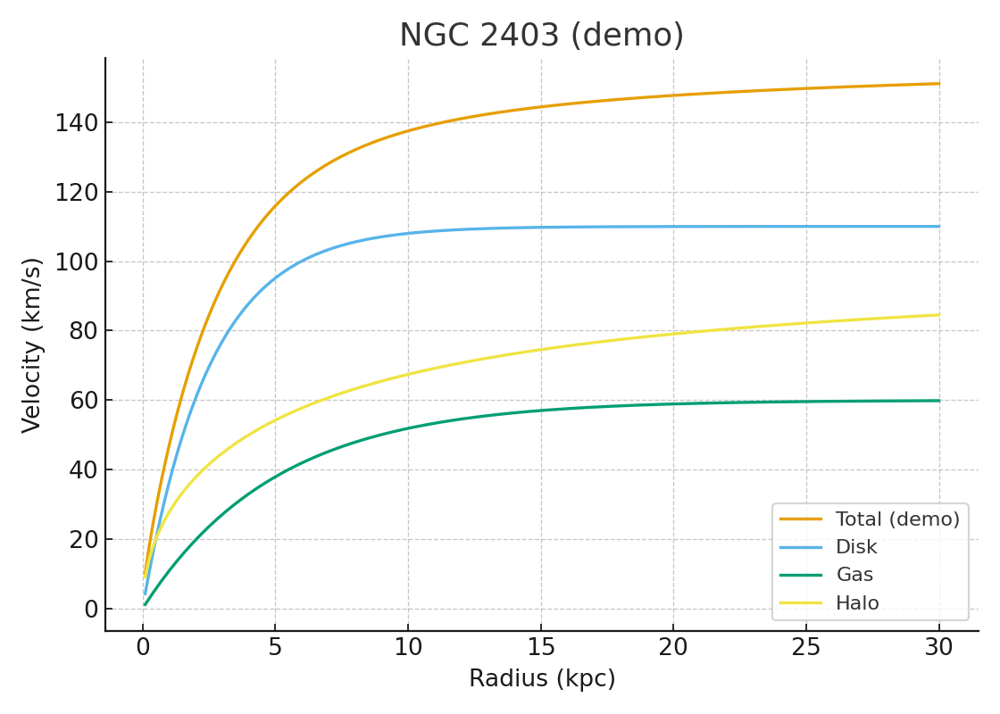
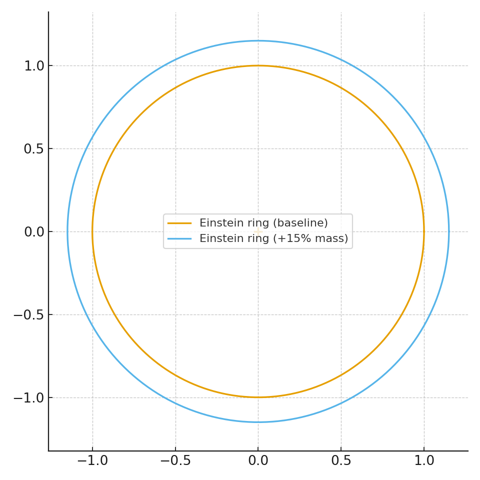

# 🌌 Relativity Living Light — Unified Photonic Superposition Model (v4)

## 🇧🇷 Síntese (PT)

Propomos que a **superposição fotônica** atua como um componente energético dinâmico que **transita** de w ≈ -1 (expansivo, tipo energia escura) para w ≈ 0 (atrativo, tipo matéria).  
Esse estado é **modulado** por **campos magnéticos cósmicos** e pelas condições **plasmáticas** (temperatura, pressão), integrando-se de forma natural na equação de Friedmann:

E²(a) = Ω_r a⁻⁴ + Ω_m a⁻³ + Ω_Λ +
Ω_s0 [f(a) + (1-f) a⁻³]   ← superposição (DE→matéria)
+ Ω_B0 a⁻⁴                ← campo magnético
+ Ω_P0 a⁻⁴                ← plasma (T,P)

com f(z) = 1 / (1 + exp((z - z_t)/w_t)).  
Opcionalmente: **correção magneto-coerente**  
Ω_s0 → Ω_s0 {1 + α_B (Ω_B0 a⁻⁴)^β}.

---

### 🔬 Observáveis e Testes com Imagens

**H(z) ratio**  

**Δμ residuals**  

**Frações de energia**  

**f(z) e w_eff(z)**  

**Bandas de entropia (10/12) — H(z) ratio**  

**Bandas de entropia (10/12) — Δμ**  

**Crescimento de estrutura fσ8(z)**  

**Curvas de rotação (toy SPARC, NGC 2403 demo)**  

**Lensing de aglomerado (demo SIS)**  

---

## 🇺🇸 Summary (EN)

We posit **photonic superposition** as a dynamic energy component that **transitions** from w ≈ -1 (dark-energy-like, expansive) to w ≈ 0 (matter-like, clustering).  
This state is **modulated** by **cosmic magnetic fields** and **plasma conditions** (temperature, pressure), naturally extending the Friedmann equation.

---

### 🔬 Key Observables with Figures

**H(z) ratio**  

**Δμ residuals**  

**Energy Fractions**  

**f(z) and w_eff(z)**  

**Entropy-margin (10/12) H ratio**  

**Entropy-margin (10/12) Δμ**  

**Structure growth fσ8(z)**  

**Rotation curve (toy SPARC, NGC 2403 demo)**  

**Cluster lensing (SIS demo)**  

