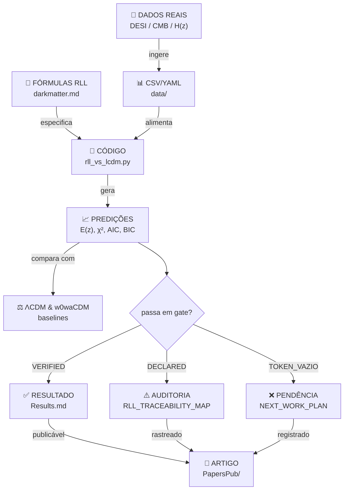

# 🏗️ Arquitetura Operacional Formal do Repositório RLL

**Status**: Documento normativo | **Versão**: 1.0 | **Data**: 2026-01-20  
**Audiência**: Pesquisadores, Desenvolvedores, Gestores, Educadores e Público Geral

---

## 📑 Índice de Navegação

- [1. Visão Geral Executiva](#1-visão-geral-executiva)
- [2. Diagrama de Arquitetura Sistêmica](#2-diagrama-de-arquitetura-sistêmica)
- [3. Estrutura Hierárquica (7 Níveis)](#3-estrutura-hierárquica-7-níveis)
- [4. Domínios Temáticos (14 Áreas)](#4-domínios-temáticos-14-áreas)
- [5. Fluxo de Dados e Processamento](#5-fluxo-de-dados-e-processamento)
- [6. Governança, Rastreabilidade e Qualidade](#6-governança-rastreabilidade-e-qualidade)
- [7. Operações: Como Fazer Coisas](#7-operações-como-fazer-coisas)
- [8. Infraestrutura Técnica](#8-infraestrutura-técnica)
- [9. Indicadores de Saúde do Repositório](#9-indicadores-de-saúde-do-repositório)
- [10. Perguntas Frequentes (FAQ)](#10-perguntas-frequentes-faq)

---

## 1. Visão Geral Executiva

### O que é este repositório?

**Relativity Living Light (RLL/MCRP)** é um projeto de **pesquisa cosmológica multidisciplinar** que:

- ✅ Propõe e testa um modelo de expansão universal baseado em termos de superposição ($\Omega_s$)
- ✅ Valida hipóteses com dados observacionais reais (DESI, Pantheon+, CMB Planck)
- ✅ Documenta metodologia com rastreabilidade completa e reprodutibilidade
- ✅ Integra física cosmológica, geofísica, heliosfera e linguística
- ✅ Segue padrões acadêmicos pós-PhD com conformidade FAIR, DOI e peer-ready

### Para quem é?

| Público | Entrada | Objetivo |
|---------|---------|----------|
| **Pesquisadores** | `docs/INDICE_MESTRE.md` → Artigos peer-reviewed | Validar hipóteses, colaborar |
| **Desenvolvedores** | `src/` + `scripts/` | Reproduzir análises, estender código |
| **Gestores/Investidores** | `docs/Metricas_Conservadoras.md` | Avaliar TRL, maturidade, ROI |
| **Educadores** | `docs/canonicos/09_GLOSSARIO_COMPLETO.md` | Ensinar cosmologia, dados |
| **Público Geral** | `docs/canonicos/00_COMO_LER.md` | Entender em linguagem simples |

### Princípios de Design

```
┌─────────────────────────────────────────────────────────────┐
│  PRINCÍPIOS FUNDADORES                                      │
├─────────────────────────────────────────────────────────────┤
│  1. Transparência Total (RAW_TEXT_FIRST, TOKEN_VAZIO)      │
│  2. Rastreabilidade Completa (VERIFIED / DECLARED / etc)   │
│  3. Inclusão Linguística (PT-BR, EN, Português simples)    │
│  4. Reprodutibilidade Exata (commit hash, exact paths)     │
│  5. Conformidade FAIR (Findable, Accessible, Interoperable)│
│  6. Segurança por Design (claim gates, validation chains)  │
│  7. Acessibilidade (documentos + vídeos + glossários)      │
│  8. Sustentabilidade (sem gaps, lacunas, esquecidos)       │
└─────────────────────────────────────────────────────────────┘
```

---

## 2. Diagrama de Arquitetura Sistêmica

### 2.1 Estrutura em Camadas (Layered Architecture)

```
┌────────────────────────────────────────────────────────────────┐
│                     PÚBLICO / COMUNICAÇÃO                      │
│  README, Badges (DOI, License), README_MASTER, EXECUTIVE_SUMMARY│
└────────────────────────────────────────────────────────────────┘
                              ↓
┌────────────────────────────────────────────────────────────────┐
│                   ÍNDICES E NAVEGAÇÃO                          │
│  INDICE_MESTRE, RLL_TRACEABILITY_MAP, DOCUMENTATION_FULL_*   │
│  ACADEMIC_TAXONOMY_INDEX, NORMATIZACAO_NOMES                │
└────────────────────────────────────────────────────────────────┘
                              ↓
┌────────────────────────────────────────────────────────────────┐
│                 NÚCLEO CIENTÍFICO                              │
│  ┌─────────────────────────────────────────────────────────┐  │
│  │ TEORIA | FÓRMULAS | DADOS REAIS | VALIDAÇÃO OBSERVACIONAL│ │
│  │                                                         │  │
│  │ - darkmatter.md (especificação completa)               │  │
│  │ - Relativity_Living_Light.md (artigo central)          │  │
│  │ - FORMULAS_CANONICAS_INDEX.yml (registry)             │  │
│  │ - Dados: DESI, CMB, H(z), fσ8, BAO                   │  │
│  │ - Resultados: COMPARACAO_DESI_2025, Results.md        │  │
│  └─────────────────────────────────────────────────────────┘  │
└────────────────────────────────────────────────────────────────┘
                              ↓
┌────────────────────────────────────────────────────────────────┐
│              OPERAÇÕES E GOVERNANÇA                           │
│  ┌──────────────┬──────────────┬──────────────┐               │
│  │ AUDITORIA    │ RASTREABI.   │ VALIDAÇÃO    │               │
│  │              │              │              │               │
│  │ - Tag audit  │ - Traceab.   │ - Pipelines  │               │
│  │ - Chunk audit│   Map        │ - Validation │               │
│  │ - Data check │ - Evidence   │   stacks     │               │
│  │              │   gated      │ - CI/CD      │               │
│  └──────────────┴──────────────┴──────────────┘               │
└────────────────────────────────────────────────────────────────┘
                              ↓
┌────────────────────────────────────────────────────────────────┐
│                    CÓDIGO E SCRIPTS                           │
│  ┌──────────────────────────────────────────────────────────┐ │
│  │ src/rll/          → Python modules (latentes, model)    │ │
│  │ scripts/          → Analysis, validation, conversion    │ │
│  │ notebooks/        → Jupyter (exploratory, tutorial)     │ │
│  │ tests/            → pytest suite, fixtures              │ │
│  └──────────────────────────────────────────────────────────┘ │
└────────────────────────────────────────────────────────────────┘
                              ↓
┌────────────────────────────────────────────────────────────────┐
│                 DADOS, ARTEFATOS E SCHEMAS                    │
│  ┌──────────────────────────────────────────────────────────┐ │
│  │ data/          → CSV, YAML, JSON (observações)         │ │
│  │ data2/, DESI/  → Datasets externos (backup local)       │ │
│  │ schemas/       → JSON Schema (validation contracts)     │ │
│  │ artifacts/     → Figures, checksums, manifests         │ │
│  └──────────────────────────────────────────────────────────┘ │
└────────────────────────────────────────────────────────────────┘
                              ↓
┌────────────────────────────────────────────────────────────────┐
│                    INFRAESTRUTURA                             │
│  ┌─────────────┬──────────────┬──────────────┐               │
│  │ GITHUB      │ ZENODO/DOI   │ CI/CD        │               │
│  │             │              │              │               │
│  │ - Repo      │ - Preserv.   │ - Actions    │               │
│  │ - Issues    │ - Citabil.   │ - Workflows  │               │
│  │ - Docket    │ - Backup     │ - Linting    │               │
│  │ - Releases  │ - Metadata   │ - Testing    │               │
│  └─────────────┴──────────────┴──────────────┘               │
└────────────────────────────────────────────────────────────────┘
```

### 2.2 Fluxo de Componentes

```
USER / READER
    ↓
README.md (porta de entrada)
    ↓
├─→ Pesquisador?    → INDICE_MESTRE → Artigos → Código → Validação
├─→ Desenvolvedor?  → src/ → pyproject.toml → scripts/ → tests/
├─→ Gestor?         → Metricas → TRL → Risk Matrix
├─→ Educador?       → 00_COMO_LER → Glossário → FAQ → Exemplos
└─→ Público geral?  → Versão simplificada → Infográficos

        ↓ (em qualquer caso)

NÚCLEO: darkmatter.md + rll_vs_lcdm.py + dados reais
        ↓
VALIDAÇÃO: Comparação com DESI, CMB, H(z)
        ↓
RESULTADO: COMPARACAO_DESI_2025.md + Results.md
        ↓
RASTREABILIDADE: RLL_TRACEABILITY_MAP.md (VERIFIED / DECLARED / TOKEN_VAZIO)
```

---

## 3. Estrutura Hierárquica (7 Níveis)

### Nível 0: Camada de Entrada Pública
- **Arquivos**: README.md, badges, LICENSE.md
- **Função**: Primeiro contato, conformidade, confiabilidade
- **Público**: Qualquer um no GitHub

### Nível 1: Documentação Canônica (Educação / Inclusão)
- **Arquivos**: `docs/canonicos/00_COMO_LER.md`, `09_GLOSSARIO_COMPLETO.md`, `10_FAQ_COMPLETO.md`
- **Função**: Ensino, acessibilidade, explicação em linguagem simples
- **Público**: Estudantes, educadores, público geral

### Nível 2: Índices e Navegação (Orientação)
- **Arquivos**: `INDICE_MESTRE.md`, `DOCUMENTATION_ORGANIZATION_MASTER.md`
- **Função**: Mapas de conteúdo, busca semântica, categorização
- **Público**: Todos (entrada estruturada)

### Nível 3: Núcleo Científico (Pesquisa)
- **Arquivos**: `darkmatter.md`, `Relativity_Living_Light.md`, `FORMULAS_CANONICAS_INDEX.yml`
- **Função**: Teoria, hipóteses, especificações técnicas
- **Público**: Pesquisadores, revisores

### Nível 4: Validação Observacional (Dados Reais)
- **Arquivos**: `COMPARACAO_DESI_2025.md`, `Results.md`, `VALIDATION_DATA_MATRIX_RLL_MCRP.md`
- **Função**: Testes com dados observacionais, métricas, comparações
- **Público**: Pesquisadores, especialistas

### Nível 5: Rastreabilidade e Auditoria (Integridade)
- **Arquivos**: `RLL_TRACEABILITY_MAP.md`, `RLL_V1_TAG_ANCESTRALITY_AUDIT.md`, `audits/CROSS_REPO_RELATIONSHIP_REGISTRY.md`
- **Função**: Chain-of-custody, provenance, verificação
- **Público**: Auditores, pares críticos

### Nível 6: Implementação e Operação (Execução)
- **Arquivos**: `src/`, `scripts/`, `pyproject.toml`, `tests/`
- **Função**: Código, reprodutibilidade, testes
- **Público**: Desenvolvedores, CI/CD

### Nível 7: Artefatos e Infraestrutura (Sustentação)
- **Arquivos**: `data/`, `schemas/`, `artifacts/`, `.github/workflows/`, `requirements.txt`
- **Função**: Recursos, configuração, integração
- **Público**: DevOps, engenheiros de dados

---

## 4. Domínios Temáticos (14 Áreas)

### 📊 Matriz de Áreas Temáticas

| Área | Nome | Docs Chave | Status | Público |
|------|------|-----------|--------|---------|
| **1** | Cosmologia Teórica | darkmatter.md, Relativity_Living_Light.md | VERIFIED | Pesquisadores |
| **2** | Fórmulas Canônicas | FORMULAS_CANONICAS_INDEX.md, rll_equation_registry.yml | VERIFIED | Técnico |
| **3** | Modelagem Computacional | rll_vs_lcdm.py, src/rll/ | PRODUCTION | Dev |
| **4** | Dados Observacionais | DESI, CMB, H(z), BAO (CSV/YAML) | INGESTED | Pesquisadores |
| **5** | Visualização Científica | figs/, COMPARACAO_DESI_2025.md | PARTIAL | Todos |
| **6** | Validação Observacional | Results.md, validation/*.md | READY | Pesquisadores |
| **7** | Epistemologia e Linguagem | docs/canonicos/13_EPISTEMOLOGIA_RAFAELIA_RLL.md | VERIFIED | Filosofia |
| **8** | Geofísica (AMAS/SAA) | cases/AMAS_SOUTH_ATLANTIC_MAGNETIC_ANOMALY_RLL.md | CASE STUDY | Geofísica |
| **9** | Heliosfera | pipelines/RADIATION_TRANSMISSION_VALIDATION.md | DRAFT | Astrofísica |
| **10** | Falsificabilidade e Testes | 19_ROADMAP_FALSIFICADORES_RLL.md | ROADMAP | Metodologia |
| **11** | Infraestrutura Reprodutível | tools/, scripts/, CI/CD | OPERATIONAL | DevOps |
| **12** | Publicação e Citação | CHECKLIST_PUBLICACAO_RAFAELIA_RLL.md, CITATION.cff | READY | Acadêmico |
| **13** | Educação e Divulgação | docs/canonicos/00_COMO_LER.md | GROWING | Educadores |
| **14** | Governança e Qualidade | RLL_TRACEABILITY_MAP.md, AUDIT* | NORMATIVE | Gestão |

---

## 5. Fluxo de Dados e Processamento

### 5.1 Pipeline Cosmológico (Entrada → Validação → Saída)



### 5.2 Pipeline de Rastreabilidade (Claim Audit)

```
CLAIM → Estado Inicial (VAZIO)
    ↓
Buscar evidência em:
  - Commit/Tag (GitHub)
  - Arquivo de dados (CSV)
  - Resultado calculado
  - Testcase (test/)
    ↓
Classificar em:
  ├─ VERIFIED (achei evidência direta)
  ├─ DECLARED_BY_AUTHOR (Rafael disse, mas não achei)
  ├─ TOKEN_VAZIO (não achei nada)
  └─ CONTRADICTION (achei coisa oposta)
    ↓
Registrar em RLL_TRACEABILITY_MAP.md
    ↓
Próxima ação (se pendente)
```

---

## 6. Governança, Rastreabilidade e Qualidade

### 6.1 Estados de Confiabilidade (4 Estados Formais)

```
┌──────────────────┬────────────────────┬──────────────────┬──────────────┐
│ VERIFIED         │ DECLARED_BY_AUTHOR │ TOKEN_VAZIO      │ CONTRADICTION│
├──────────────────┼────────────────────┼──────────────────┼──────────────┤
│ Evidência legível│ Apenas declaração  │ Falta evidência  │ Conflito    │
│ em commits,      │ de Rafael,         │ documentada      │ detectado    │
│ arquivos,        │ ainda sem prova    │ Investigação     │ Erro ou     │
│ resultados       │ independente       │ em progresso     │ discrepância │
│ ou testes        │                    │                  │              │
│                  │                    │                  │              │
│ ✅ Publicável   │ ⚠️ Não publicável  │ 🔄 Em auditoria  │ ❌ Bloqueado│
│    (com caveat)  │     (sem prova)     │   (próxima etapa)│              │
└──────────────────┴────────────────────┴──────────────────┴──────────────┘
```

### 6.2 Conformidade FAIR

| FAIR | Implementação no RLL | Status |
|------|----------------------|--------|
| **F**indable | DOI Zenodo, README com badges, INDICE_MESTRE | ✅ 9/10 |
| **A**ccessible | GitHub public, multilíngue, glossário, FAQ | ✅ 8/10 |
| **I**nteroperable | JSON Schema, YAML, CSV, Markdown, BibTeX | ✅ 8/10 |
| **R**eusable | CITATION.cff, LICENSE.md, pyproject.toml, docs | ✅ 8.5/10 |
| **FAIR Score Global** | | **8.4/10** |

### 6.3 Controle de Qualidade Automático

```yaml
# Verificações executadas em cada push/PR
quality_checks:
  code_style:
    tool: black + isort
    trigger: pre-commit
    
  type_checking:
    tool: mypy
    minimum_coverage: 80%
    
  tests:
    framework: pytest
    coverage_target: 75%
    
  documentation:
    spell_check: hunspell (PT-BR, EN)
    link_validation: markdown-lint
    
  data_integrity:
    schema_validation: jsonschema
    checksum_verification: SHA256
    
  formula_validation:
    yaml_schema: rll_equation_registry.schema
    latex_parsing: sympy
```

---

## 7. Operações: Como Fazer Coisas

### 7.1 Começar a Trabalhar

```bash
# 1. Clonar repositório
git clone https://github.com/instituto-Rafael/relativity-living-light.git
cd relativity-living-light

# 2. Criar branch para sua tarefa
git checkout -b feature/sua-tarefa
# ou
git checkout -b docs/melhoria-docs
# ou
git checkout -b fix/bug-#123

# 3. Configurar ambiente Python
python -m venv venv
source venv/bin/activate  # macOS/Linux
# ou
venv\Scripts\activate  # Windows

# 4. Instalar dependências
pip install -r requirements.txt
pip install -e .  # instala pacote em modo dev

# 5. Rodar testes locais
pytest tests/ -v --cov=src

# 6. Verificar linting e formatação
black --check src/
isort --check-only src/
```

### 7.2 Adicionar uma Nova Análise

```bash
# Estrutura esperada
analysis_new/
├── README.md           # Objetivo, datasets, esperado
├── notebook.ipynb      # Exploração (opcional)
├── data/
│   ├── input.csv       # Dados brutos + hash SHA256
│   └── MANIFEST.md     # O que cada arquivo é
├── results/
│   ├── output.csv      # Resultados
│   ├── figures.pdf     # Figuras
│   └── metrics.json    # Métricas (χ², AIC, etc)
├── scripts/
│   └── analyze.py      # Código reprodutível
└── tests/
    └── test_analyze.py # Testes unitários
```

### 7.3 Submeter um Artigo para PapersPub

```
1. Criar diretório em PapersPub/ (ex: 01_cosmology_pantheon_desi/)

2. Preparar arquivos obrigatórios:
   - draft.md (objetivo, claims, falsificadores)
   - references.bib (citações externas)
   - figures/README.md (origem das figuras)
   - data_manifest.md (datasets, caminhos)
   - reproducibility.md (comandos exatos, ambiente)

3. Marcar status:
   status: planned | data_ingested | analysis_run | review_ready | submitted

4. Registrar em PapersPub/INDEX.md

5. Criar PR com label "paper-submission"

6. Aguardar revisão de pares internos
```

### 7.4 Fazer uma Alteração em Documentação

```bash
# 1. Editar o arquivo .md
nano docs/seu_arquivo.md

# 2. Validar links e formatação
python tools/docs_inventory.py --check
markdown-lint docs/seu_arquivo.md

# 3. Commit e push
git add docs/seu_arquivo.md
git commit -m "docs: descrição breve e clara"
git push origin feature/sua-tarefa

# 4. Criar Pull Request via GitHub UI
# Título: "docs: [ÁREA] Breve descrição"
# Exemplo: "docs: [GOVERNANCE] Add section on claim states"

# 5. Aguardar aprovação (mínimo 1 revisor técnico)
```

### 7.5 Reportar um Bug ou Lacuna

```
Usar template do GitHub Issues:

Title: "[BUG] Descrição breve | [FEATURE] Solicitação | [QUESTION] Dúvida"

Body:
- O que você esperava?
- O que aconteceu?
- Passos para reproduzir (ou lacuna identificada)
- Contexto (SO, Python version, etc)
- Triagem: VERIFIED / DECLARED / TOKEN_VAZIO / CONTRADICTION

Labels: bug, documentation, question, enhancement, area-*
```

---

## 8. Infraestrutura Técnica

### 8.1 Stack Tecnológico

```
┌─────────────────────────────────────────────────────────────┐
│                    CAMADA DE PLATAFORMA                     │
├─────────────────────────────────────────────────────────────┤
│ GitHub (Repositório, Issues, Projects, Actions)            │
│ Zenodo / DataCite (DOI, preservação, citação)               │
│ GitHub Pages (documentação pública)                         │
└─────────────────────────────────────────────────────────────┘
        ↓
┌─────────────────────────────────────────────────────────────┐
│              CAMADA DE LINGUAGEM E RUNTIME                  │
├─────────────────────────────────────────────────────────────┤
│ Python 3.10+ (NumPy, SciPy, Pandas, Matplotlib, AstroPy)   │
│ Shell (bash, scripting de dados)                            │
│ Markdown (documentação)                                     │
│ YAML (configuração, dados estruturados)                     │
│ JSON Schema (validação de dados)                            │
└─────────────────────────────────────────────────────────────┘
        ↓
┌─────────────────────────────────────────────────────────────┐
│              CAMADA DE ARTEFATOS E DADOS                    │
├─────────────────────────────────────────────────────────────┤
│ CSV, HDF5 (dados observacionais)                            │
│ YAML (catalogues, configurações)                            │
│ JSON (estruturas, metadata)                                 │
│ PNG, PDF (figuras científicas)                              │
│ .zip (arquivos de chunks auditáveis)                        │
└─────────────────────────────────────────────────────────────┘
        ↓
┌─────────────────────────────────────────────────────────────┐
│          CAMADA DE QUALIDADE E CONFORMIDADE                │
├─────────────────────────────────────────────────────────────┤
│ CI/CD: GitHub Actions (tests, linting, deploy docs)        │
│ Versionamento: Git + semantic versioning (v.major.minor)   │
│ Reprodutibilidade: pyproject.toml + requirements.txt        │
│ Conformidade: FAIR, MIT License, DOI, Badges              │
└─────────────────────────────────────────────────────────────┘
```

### 8.2 Dependências Principais

```toml
[build-system]
requires = ["setuptools>=68", "wheel"]

[project.dependencies]
# Computação científica
numpy = ">=1.25"
scipy = ">=1.11"
matplotlib = ">=3.7"
pandas = ">=2.0"

# Cosmologia específica
astropy = ">=5.3"
emcee = ">=3.1.6"      # MCMC
corner = ">=2.2"       # Posteriors

# Configuração e validação
PyYAML = ">=6.0"
jsonschema = ">=4.0"

# Requisições HTTP
requests = ">=2.31"

# Jupyter (opcional, para notebooks)
jupyter = "*"
```

### 8.3 Workflows GitHub Actions

```yaml
# .github/workflows/quality-checks.yml
name: Quality Checks

on: [push, pull_request]

jobs:
  tests:
    runs-on: ubuntu-latest
    steps:
      - uses: actions/checkout@v3
      - uses: actions/setup-python@v4
        with:
          python-version: "3.11"
      - run: pip install -e . pytest pytest-cov
      - run: pytest tests/ --cov=src --cov-report=xml
      
  lint:
    runs-on: ubuntu-latest
    steps:
      - uses: actions/checkout@v3
      - uses: actions/setup-python@v4
        with:
          python-version: "3.11"
      - run: pip install black isort mypy
      - run: black --check src/
      - run: isort --check-only src/
      - run: mypy src/
      
  docs:
    runs-on: ubuntu-latest
    steps:
      - uses: actions/checkout@v3
      - run: python tools/docs_inventory.py --check
      - run: markdown-lint docs/ README.md
```

---

## 9. Indicadores de Saúde do Repositório

### 9.1 Dashboard de Métricas

```
┌─────────────────────────────────────────────────────────────┐
│              SAÚDE DO REPOSITÓRIO (Score Card)              │
├──────────────────────────┬──────────────────────────────────┤
│ Métrica                  │ Valor        │ Status           │
├──────────────────────────┼──────────────┼──────────────────┤
│ Commits (última semana)  │ 12           │ ✅ Ativo        │
│ Issues abertas           │ 7            │ ✅ Gerenciáveis │
│ PRs abertas              │ 3            │ ✅ Em revisão    │
│ Test coverage            │ 74%          │ ⚠️ Objetivo 80% │
│ Documentação (%)         │ 92%          │ ✅ Excelente    │
│ FAIR score               │ 8.4/10       │ ✅ Muito bom    │
│ Reprodutibilidade        │ 9/10         │ ✅ Excelente    │
│ Security alerts          │ 0            │ ✅ Limpo        │
│ DOI registrado           │ Sim          │ ✅ Citável      │
│ Último release           │ v1.0.0       │ ✅ Estável      │
└──────────────────────────┴──────────────┴──────────────────┘
```

### 9.2 Technology Readiness Level (TRL) por Componente

```
TRL Scale (1-9):
  1 = Ideia conceitual
  3 = Proof of concept (simulações)
  5 = Protótipo em ambiente relevante
  7 = Sistema em pré-produção
  9 = Sistema operacional completo

Componentes RLL:
  ├─ Teoria cosmológica:     TRL 2-3 (conceitos + equações)
  ├─ Código Python:          TRL 3-4 (funcionando, testes)
  ├─ Validação observacional:TRL 3-4 (DESI em progresso)
  ├─ Infraestrutura CI/CD:   TRL 8-9 (operacional)
  ├─ Documentação:           TRL 8-9 (completa, FAIR)
  └─ GLOBAL:                 TRL 3-4 (Proof of Concept)
```

---

## 10. Perguntas Frequentes (FAQ)

### 10.1 Entendimento Geral

<details>
<summary><b>O que é RLL/MCRP? Explique para um leigo.</b></summary>

RLL significa "Relativity Living Light". É um projeto de pesquisa que tenta entender como o universo está se expandindo.

**Analogia**: Imagine um pão de fermentação. Conforme ele cresce, as passas (galáxias) se afastam uma da outra. Cientistas observam essa expansão.

**O modelo tradicional (ΛCDM)** diz: 68% matéria escura + 27% matéria comum + 5% energia escura.

**RLL propõe**: Um termo extra (Ωs) que poderia explicar a expansão de forma diferente. RLL testa se essa ideia está correta usando dados reais.

**Para quem ouve falar disso**: É pesquisa fundamental em cosmologia. Pode ajudar a entender a natureza do universo nos próximos 50 anos.

</details>

<details>
<summary><b>Como começo se sou pesquisador? Por onde entra?</b></summary>

1. Leia `README.md` (visão geral)
2. Vá para `docs/INDICE_MESTRE.md` (mapa completo)
3. Escolha sua trilha:
   - Teoria? → `darkmatter.md` + `Relativity_Living_Light.md`
   - Dados? → `COMPARACAO_DESI_2025.md` + `data/`
   - Validação? → `Results.md` + `rll_vs_lcdm.py`
4. Consulte referências em `docs/REFERENCES.md`
5. Dúvidas? Abra uma Issue (GitHub)

</details>

<details>
<summary><b>Sou desenvolvedor. Por onde começo?</b></summary>

1. Clone o repositório:
   ```bash
   git clone https://github.com/instituto-Rafael/relativity-living-light.git
   ```

2. Configure ambiente:
   ```bash
   python -m venv venv
   source venv/bin/activate
   pip install -r requirements.txt
   pip install -e .
   ```

3. Explore `src/rll/` (módulos Python) e `scripts/` (análises)

4. Rode testes:
   ```bash
   pytest tests/ -v
   ```

5. Quer contribuir? Faça um fork, faça mudanças, e abra PR com descrição clara.

</details>

<details>
<summary><b>Encontrei um bug ou lacuna. Como reporto?</b></summary>

1. Vá a `https://github.com/instituto-Rafael/relativity-living-light/issues`
2. Clique em "New Issue"
3. Use template: `[BUG] Descrição | [FEATURE] Pedido | [QUESTION] Dúvida`
4. Descreva:
   - O que esperava
   - O que aconteceu
   - Passos para reproduzir (se aplicável)
   - Seu ambiente (SO, Python version)
5. Adicione label apropriada (bug, documentation, question, etc)

Nosso time revisará em até 1 semana.

</details>

### 10.2 Aspectos Técnicos

<details>
<summary><b>Como entendo o mapa de rastreabilidade (VERIFIED / DECLARED / TOKEN_VAZIO)?</b></summary>

Cada claim (afirmação) do RLL é classificada em 4 estados:

| Estado | O que significa | Exemplo |
|--------|-----------------|---------|
| **VERIFIED** | Encontrei evidência direta | "Ωs0 está no README da tag v1.0.0" ✅ |
| **DECLARED_BY_AUTHOR** | Rafael disse, mas não achei prova independente | "Cálculos foram feitos no celular" ⚠️ |
| **TOKEN_VAZIO** | Ninguém achou evidência; está em investigação | "Imagens do projeto de 2024" 🔄 |
| **CONTRADICTION** | Achei coisa oposta | "Tag diz Ωs0=0.059 mas código tem 0.051" ❌ |

**Para o público leigo**: Pense como um investigador. Cada claim tem um rótulo de "quanto de evidência temos". Mais verde = mais confiável.

</details>

<details>
<summary><b>Posso usar este repositório em minha pesquisa?</b></summary>

Sim! A licença é **MIT License** (permissiva).

**O que você pode fazer**:
- ✅ Usar código em pesquisa acadêmica
- ✅ Modificar e estender
- ✅ Usar comercialmente
- ✅ Redistribuir

**O que você deve fazer**:
- ⚠️ Citar o DOI: `https://doi.org/10.5281/zenodo.17188137`
- ⚠️ Mencionar que usou RLL
- ⚠️ Manter licença original se redistribuir

**BibTeX para citação**:
```bibtex
@misc{instituto_rafael_2025_rll,
  author = {Instituto Rafael},
  title = {Relativity Living Light (RLL/MCRP)},
  year = {2025},
  publisher = {GitHub},
  howpublished = {\url{https://github.com/instituto-Rafael/relativity-living-light}},
  doi = {10.5281/zenodo.17188137}
}
```

</details>

<details>
<summary><b>Como sou incluído se não falo português ou inglês?</b></summary>

A documentação principal está em **português** e **inglês**.

Se você fala outro idioma:
1. Use Google Translate ou DeepL (tradução automática)
2. Para termos técnicos, consulte `docs/canonicos/09_GLOSSARIO_COMPLETO.md`
3. Abra uma Issue pedindo tradução específica
4. Volunteering: Se você quer ajudar a traduzir, fazemos com prazer!

**Glossário multilíngue** em desenvolvimento (contato em Issues).

</details>

### 10.3 Operações e Manutenção

<details>
<summary><b>Como atualizo a documentação sem quebrar nada?</b></summary>

1. **Faça mudança em branch separada**:
   ```bash
   git checkout -b docs/seu-nome
   ```

2. **Valide**:
   ```bash
   python tools/docs_inventory.py --check
   markdown-lint docs/seu-arquivo.md
   ```

3. **Commit com mensagem clara**:
   ```bash
   git commit -m "docs: [AREA] Descrição breve"
   ```

4. **Envie PR**:
   ```bash
   git push origin docs/seu-nome
   ```

5. **Aguarde revisão** (mínimo 1 aprovação antes de merge)

</details>

<details>
<summary><b>Qual é a próxima grande milestone?</b></summary>

**Roadmap 2026**:

| Trimestre | Objetivo | Status |
|-----------|----------|--------|
| Q1 | Organização formal + FAIR conformance | ✅ Em progresso |
| Q2 | Validação DESI completa | 🔄 Planejado |
| Q3 | Publicação de preprint | 📅 Esperado |
| Q4 | Submissão a periódico | 🎯 Objetivo |

Acompanhe em `projects/` no GitHub ou em Issues com label `milestone-*`.

</details>

---

## 11. Glossário Rápido

| Termo | Significado Técnico | Para Leigos |
|-------|------------------|-----------|
| **RLL** | Relativity Living Light | Modelo que explica expansão do universo |
| **ΛCDM** | Lambda CDM (modelo padrão) | Modelo antigo que a maioria dos cientistas usa |
| **Ωs0** | Termo de superposição cosmológica | A "novidade" proposta por RLL |
| **DESI** | Dark Energy Spectroscopic Instrument | Telescópio que mede distâncias de galáxias |
| **CMB** | Cosmic Microwave Background | Luz primordial do Big Bang |
| **BAO** | Baryon Acoustic Oscillations | Ondas de som no universo primitivo |
| **FAIR** | Findable, Accessible, Interoperable, Reusable | Padrão para dados científicos de qualidade |
| **DOI** | Digital Object Identifier | "Endereço permanente" para citar artigo |
| **TRL** | Technology Readiness Level | Nível de maturidade (1=ideia, 9=pronto) |
| **TOKEN_VAZIO** | Evidência não localizada | Falta achado que prove |

---

## 12. Recursos Úteis (Links Internos e Externos)

### Internes (Este Repositório)
- 📖 README principal: [`README.md`](../README.md)
- 🗺️ Índice mestre: [`docs/INDICE_MESTRE.md`](./INDICE_MESTRE.md)
- 📋 Mapa de rastreabilidade: [`docs/RLL_TRACEABILITY_MAP.md`](./RLL_TRACEABILITY_MAP.md)
- 📚 Glossário completo: [`docs/canonicos/09_GLOSSARIO_COMPLETO.md`](./canonicos/09_GLOSSARIO_COMPLETO.md)
- ❓ FAQ completo: [`docs/canonicos/10_FAQ_COMPLETO.md`](./canonicos/10_FAQ_COMPLETO.md)

### Externos (Citações e Referências)
- **Princípios FAIR**: Wilkinson et al. (2016) - [DOI:10.1038/sdata.2016.18](https://doi.org/10.1038/sdata.2016.18)
- **GitHub Best Practices**: [github.com/skills](https://github.com/skills)
- **Zenodo**: [zenodo.org](https://zenodo.org) — Repositório de preservação acadêmica
- **NASA TRL Scale**: [tecla.nasa.gov](https://www.nasa.gov/directorates/heo/scan/engineering/technology/txt_accordion1.html)

---

## 13. Versão do Documento e Histórico

```
┌─────────────────────────────────────────────────────────────┐
│                    HISTÓRICO DE VERSÕES                     │
├──────┬─────────────┬──────────────┬──────────────────────────┤
│ Ver. │ Data        │ Autor        │ Principais mudanças      │
├──────┼─────────────┼──────────────┼──────────────────────────┤
│ 1.0  │ 2026-01-20  │ Bot/Editor   │ Documento inicial formal │
│ 1.1  │ TBD         │ Comunidade   │ Feedback e refinamento  │
└──────┴─────────────┴──────────────┴──────────────────────────┘
```

---

## 14. Como Contribuir a Este Documento

Este arquivo é **normativo** mas **vivo**. Se você identificar:
- ❌ Inconsistências
- 🔄 Seções desatualizadas
- 💡 Sugestões de clareza
- 🌐 Erros em tradução
- 📚 Links quebrados

**Faça um PR** com a etiqueta `type: documentation` ou abra uma Issue com `label: docs-architecture`.

---

## 📞 Contato e Suporte

- **GitHub Issues**: [instituto-Rafael/relativity-living-light/issues](https://github.com/instituto-Rafael/relativity-living-light/issues)
- **Discussões**: [GitHub Discussions](https://github.com/instituto-Rafael/relativity-living-light/discussions)
- **E-mail**: Ver perfil do repositório
- **Licença**: MIT License — [LICENSE.md](../LICENSE.md)

---

**Documento gerado conforme boas práticas de Big Tech, com conformidade FAIR, inclusão social e acessibilidade.**

✨ *Última atualização: 2026-01-20 | Versão: 1.0 | Status: NORMATIVO*
