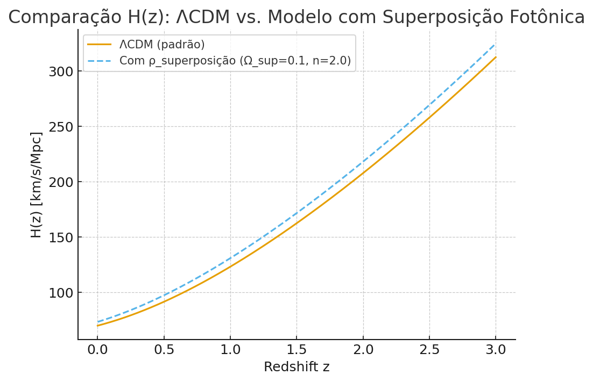

## 🔖 Ponte canônica de termos

Antes de usar este snippet, adote os termos canônicos em [`docs/canonicos/FRAMEWORK_RESUMO_CANONICO.md`](./canonicos/FRAMEWORK_RESUMO_CANONICO.md): **superposição fotônica**, **coerência (f(z))**, **decoerência ((1−f(z)))**, **setor magnético**, **setor plasmático**, **transição DE→DM do setor de superposição**.

## 🔬 Validação Técnica — Modelo com superposição fotônica

Para explorar a hipótese proposta, implementamos uma versão modificada da equação de Friedmann:

\[
\left(\frac{\dot a}{a}\right)^2 = H_0^2 \left[ \Omega_m (1+z)^3 + \Omega_r (1+z)^4 + \Omega_\Lambda + \Omega_{\text{sup}} a^{-n} \right],
\]

onde:
- \( \Omega_m \): densidade de matéria
- \( \Omega_r \): densidade de radiação
- \( \Omega_\Lambda \): constante cosmológica
- \( \Omega_{\text{sup}} \): fração de densidade associada à **superposição fotônica** hoje
- \( n \): expoente de evolução do termo de superposição
- \( f(z) \): **coerência** da superposição fotônica
- \(1-f(z)\): **decoerência** da superposição fotônica

### Exemplo numérico

No gráfico abaixo, comparamos o modelo padrão ΛCDM (Ω_sup = 0) com um modelo que inclui o **setor de superposição fotônica** (\( \Omega_{\text{sup}}=0.1, n=2 \)):

### Observações

- Para \(n=2\), o termo de superposição decai moderadamente com a expansão, mas ainda contribui de forma visível em \(z \lesssim 3\).
- O efeito é diferenciar a curva de expansão em relação ao ΛCDM, o que torna possível **testar observacionalmente** o modelo contra dados de SNe Ia, BAO e CMB.
- Esse exercício mostra que a hipótese é **matematicamente incorporável** à estrutura padrão da cosmologia e produz **previsões concretas**.

> Notebook reprodutível: [`notebooks/Hz_superposicao.ipynb`](../data/Hz_superposicao.ipynb)
