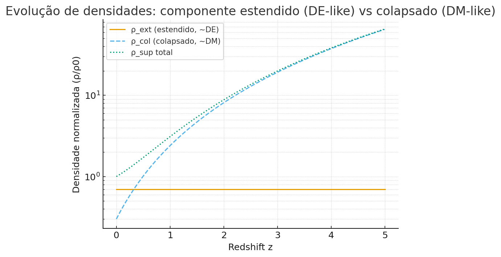
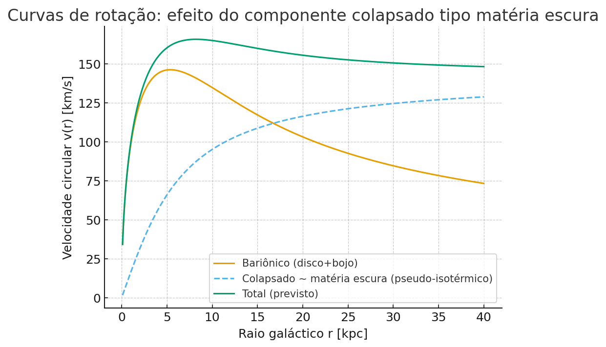

## 🔭 Extensão do Modelo: Unificando energia escura e matéria escura via ρ_superposição

**Ideia:** decompor o termo de superposição fotônica em duas partes
\(\rho_{\text{sup}} = \rho_{\text{ext}} + \rho_{\text{col}}\), onde:
- **Estendido** (\(\rho_{\text{ext}}\)): estado coeso e global da luz, com equação de estado \(w \approx -1\) (\(n\!\approx\!0\)).
- **Colapsado** (\(\rho_{\text{col}}\)): estado local/coerente que se comporta como massa efetiva (\(w \approx 0\), \(n\!\approx\!3\)).

Parametrização mínima (exemplo):
\[
\rho_{\text{sup}}(a) = \rho_{0}\big[f_{\text{ext}}\, a^{-n_{\text{ext}}} + (1-f_{\text{ext}})\, a^{-n_{\text{col}}}\big],
\]
com \(f_{\text{ext}}\in[0,1]\), \(n_{\text{ext}}\approx 0\), \(n_{\text{col}}\approx 3\).

### 1) Evolução de densidades (DE-like vs DM-like)

Acima: para \(f_{\text{ext}}=0.7\), o termo estendido domina em baixos redshifts (efeito **expansivo**), enquanto o termo colapsado cresce para o passado (efeito **gravitacionalmente atrativo**).

### 2) Curvas de rotação galácticas (toy model)

Usamos um disco/bojo bariônico simplificado somado a um halo **pseudo-isotérmico** (\(\rho=\rho_0/[1+(r/r_c)^2]\)), interpretado aqui como **\(\rho_{\text{col}}\)**. O resultado qualitativo reproduz o **achatamento** das curvas de rotação observado em muitas galáxias, típico de um componente do tipo matéria escura.

> Referências de contexto: equações de Friedmann e \(w(z)\) para energia escura (PDG 2023); curvas de rotação e halos pseudo-isotérmicos; revisões sobre condensados fotônicos (BEC de fótons) que ilustram como luz pode adquirir dinâmica "de fluido" sob confinamento.

---

### 🇬🇧 Brief (EN)

We split **photonic superposition** into an **extended** piece (dark-energy-like, \(w\!\approx\!-1\)) and a **collapsed** piece (dark-matter-like, \(w\!\approx\!0\)). A minimal parameterization
\(\rho_{\text{sup}}(a)=\rho_0[f_{\text{ext}}a^{-n_{\text{ext}}}+(1-f_{\text{ext}})a^{-n_{\text{col}}}]\)
yields distinct, testable signatures:
- a late-time accelerated expansion (extended component dominates at low \(z\)),
- and flattened **galaxy rotation curves** via a pseudo-isothermal halo profile as a proxy for the collapsed component.

See figures above and the FLRW notebook for reproducibility.