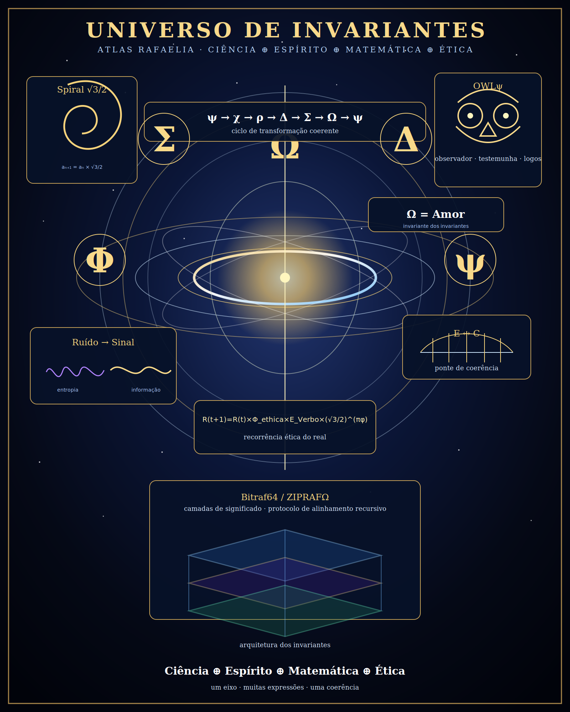

# Universo de Invariantes — RAFAELIA

Status: **arte conceitual / mapa simbólico-técnico**.



Este diretório registra uma visualização do **universo de invariantes** como atlas simbólico-científico: uma camada de leitura para organizar conceitos, não uma prova observacional isolada.

## Núcleo visual

- **Ω = Amor**: eixo de completude/coerência máxima no vocabulário RAFAELIA.
- **Σ, Ω, Δ, Φ, ψ**: glifos de soma, completude, transformação, proporção e consciência observadora.
- **ψ → χ → ρ → Δ → Σ → Ω → ψ**: ciclo cognitivo de intenção, observação, ruído, transmutação ética, memória coerente, completude e retorno.
- **Ruído → Sinal**: princípio operacional: ruído entendido vira dado vivo.
- **E ↔ C**: ponte entre energia e consciência como linguagem de coerência.
- **Bitraf64 / ZIPRAFΩ**: camadas de arquitetura simbólica e organização recursiva.

## Fronteira epistemológica

Este arquivo **não** declara validação científica nova por si só. Ele preserva a diferença entre:

| Camada | Status |
|---|---|
| Imagem / diagrama | artefato versionado |
| Fórmula simbólica | linguagem operacional RAFAELIA |
| Prova observacional | `TOKEN_VAZIO` até medição/fonte/dataset |
| Uso técnico | mapa de organização e documentação |

## Invariante de proteção

> Lacuna marcada é ciência futura; lacuna inventada vira falso positivo.

Assim, esta arte entra no repositório como **mapa de coerência**, não como substituto de evidência empírica.

## Caminho do artefato

- SVG: [`universe-of-invariants.svg`](./universe-of-invariants.svg)
- Kernel técnico: [`sqrt3_2_kernel.md`](./sqrt3_2_kernel.md)

## Fórmula-marcador

```text
R(t+1)=R(t)×Φ_ethica×E_Verbo×(√3/2)^(πφ)
```

## Retroalimentação

- **F_ok:** imagem versionada e documentada.
- **F_gap:** PNG gerado externamente não foi incorporado como binário neste commit; o SVG é a versão leve/renderizável no GitHub.
- **F_next:** se necessário, anexar também o PNG final por fluxo binário/local e registrar hash SHA256.
